# Craybond Project Structure

## Overview
Craybond is an AArch64 bare-metal kernel project with graphics and process management capabilities, designed to run on QEMU's virt machine.

## Architecture

```mermaid
graph TB
    subgraph Kernel["🔧 Kernel Core"]
        Boot["boot.s<br/>Assembly entry point"]
        Main["kernel.c<br/>Main kernel initialization"]
        Types["types.h<br/>Type definitions"]
    end
    
    subgraph Memory["💾 Memory Management"]
        MMU["mmu.c/h<br/>Memory Management Unit"]
        DMA["dma.c/h<br/>Direct Memory Access"]
        RAM["ram_e.c/h<br/>RAM error handling"]
    end
    
    subgraph Hardware["⚙️ Hardware Abstraction"]
        GIC["gic.c/h<br/>Generic Interrupt Controller"]
        DTB["dtb.c/h<br/>Device Tree Blob parser"]
        PCI["pci.c/h<br/>PCI bus support"]
        FW["fw_cfg.c/h<br/>Firmware config"]
    end
    
    subgraph Process["🔄 Process Management"]
        Scheduler["scheduler.c/h<br/>Task scheduling"]
        ProcAlloc["proc_allocator.c/h<br/>Process allocation"]
        Context["context_switch.S<br/>Context switching"]
        Syscall["syscall.c/h<br/>System calls"]
    end
    
    subgraph IO["📱 I/O & Console"]
        KIO["console/kio.c/h<br/>Kernel I/O"]
        KConsole["console/kconsole/*<br/>Console implementation"]
        UART["console/serial/uart.c/h<br/>Serial communication"]
    end
    
    subgraph Graphics["🎨 Graphics"]
        GraphicsCore["graph/graphics.c/h<br/>Graphics engine"]
        RAMFB["graph/drivers/ramfb_driver/*<br/>RAM framebuffer driver"]
        VIRTIO["graph/drivers/virtio_gpu_pci/*<br/>Virtio GPU driver"]
        TextWin["graph/windows/textwindow.c/h<br/>Text rendering"]
        Font["graph/font8x8_basic.h<br/>8x8 bitmap fonts"]
    end
    
    Boot --> Main
    Main --> Memory
    Main --> Hardware
    Main --> Process
    Main --> IO
    Main --> Graphics
```



## Directory Details

### Root Level
| File | Purpose |
|------|---------|
| `boot.s` | AArch64 assembly entry point, CPU initialization |
| `kernel.c` | Main kernel init, subsystem coordination |
| `linker.ld` | Linker script defining memory layout |
| `Makefile` | Build configuration |
| `mtree.txt` | QEMU machine tree description |

### Memory Management (`/`)
| File | Purpose |
|------|---------|
| `mmu.c/h` | Virtual memory, page tables |
| `dma.c/h` | Direct Memory Access controller |
| `ram_e.c/h` | RAM error detection/correction |

### Hardware Drivers (`/`)
| File | Purpose |
|------|---------|
| `gic.c/h` | GIC interrupt controller driver |
| `dtb.c/h` | Device Tree Binary parsing |
| `pci.c/h` | PCI device enumeration |
| `fw_cfg.c/h` | QEMU firmware configuration interface |
| `exception_handler.c/h` | CPU exception handling |
| `exception_vectors_as.S` | ARM exception vector table |

### Process Management (`/process/`)
| File | Purpose |
|------|---------|
| `scheduler.c/h` | CPU scheduling algorithm |
| `proc_allocator.c/h` | Process creation/destruction |
| `process.h` | Process structure definitions |
| `context_switch.S` | Low-level context switching |
| `syscall.c/h` | System call dispatcher |
| `syscall_as.S` | Syscall assembly entry |

### Console I/O (`/console/`)
| Component | Purpose |
|-----------|---------|
| `kio.c/h` | High-level kernel I/O abstraction |
| `serial/uart.c/h` | UART serial driver |
| `kconsole/` | Console UI implementation (C/C++) |

### Graphics (`/graph/`)
| Component | Purpose |
|-----------|---------|
| `graphics.c/h` | Core graphics rendering |
| `graphic_types.h` | Graphics data structures |
| `font8x8_basic.h` | 8x8 bitmap font data |
| `drivers/ramfb_driver/` | RAM framebuffer driver |
| `drivers/virtio_gpu_pci/` | Virtio GPU PCI device driver |
| `windows/textwindow.c/h` | Text window rendering |

### Utilities (`/`)
| File | Purpose |
|------|---------|
| `string.c/h` | String manipulation functions |
| `types.h` | Fundamental type definitions |

## Build System

```
make          → Build kernel.elf
make clean    → Remove build artifacts
./run         → Build and run in QEMU
./run debug   → Run with GDB debugging enabled
```

## Build Targets
- **kernel.elf**: Main executable kernel image
- Supports AArch64 bare-metal compilation
